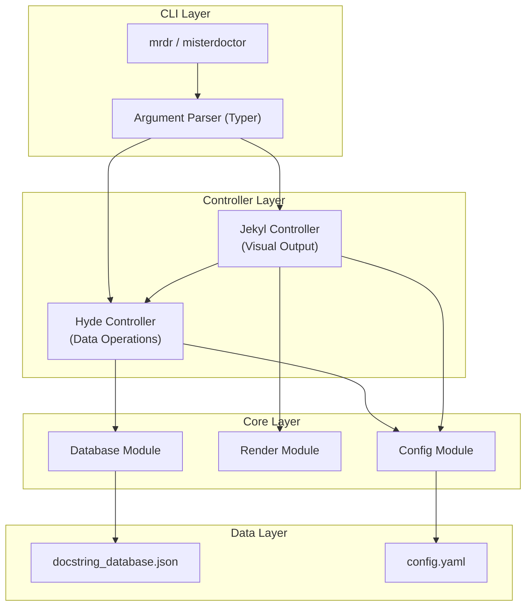
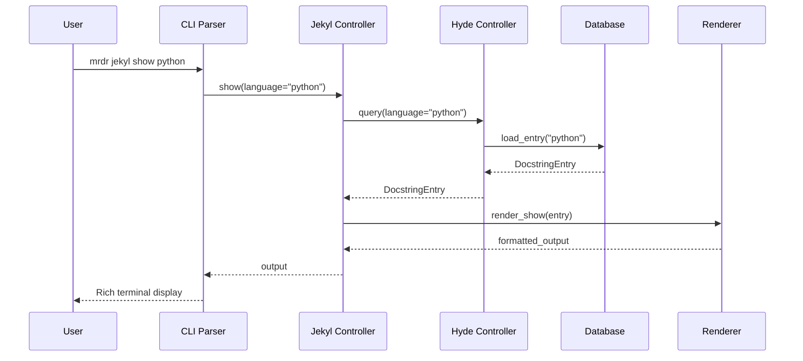

# Design Document: MRDR CLI Foundation
[MRDR:doc:spec=doctags](/docs/doctags.md)

## Overview

The MRDR CLI Foundation is a modular Python command-line application built on the Rich library ecosystem. It implements a dual-controller architecture (`hyde` for data operations, `jekyl` for visual rendering) that separates concerns between data access and presentation. The initial release focuses on docstring syntax display with a comprehensive foundation designed for future extensibility.

The architecture follows the principle of "docs → src → cli nametype cohesion" ensuring consistent naming across documentation, source code, and CLI commands.

## Architecture

### High-Level Architecture



### Module Structure

```
src/
├── mrdr/
│   ├── __init__.py           # Package init, version
│   ├── __main__.py           # Entry point: python -m mrdr
│   ├── cli/
│   │   ├── __init__.py
│   │   ├── app.py            # Typer app definition
│   │   ├── hyde_commands.py  # Hyde subcommands
│   │   ├── jekyl_commands.py # Jekyl subcommands
│   │   └── common.py         # Shared CLI utilities
│   ├── controllers/
│   │   ├── __init__.py
│   │   ├── base.py           # Controller protocol/interface
│   │   ├── hyde.py           # Hyde controller implementation
│   │   └── jekyl.py          # Jekyl controller implementation
│   ├── database/
│   │   ├── __init__.py
│   │   ├── loader.py         # JSON/YAML loading
│   │   ├── schema.py         # Pydantic models for validation
│   │   └── query.py          # Query operations
│   ├── render/
│   │   ├── __init__.py
│   │   ├── base.py           # Renderer protocol
│   │   ├── rich_renderer.py  # Rich-based renderer
│   │   ├── plain_renderer.py # Plain text renderer
│   │   ├── json_renderer.py  # JSON output renderer
│   │   └── components/
│   │       ├── __init__.py
│   │       ├── golden_screen.py  # Standard output layout
│   │       ├── tables.py         # Table components
│   │       ├── panels.py         # Panel components
│   │       └── plusrep.py        # PLUSREP display
│   ├── config/
│   │   ├── __init__.py
│   │   ├── loader.py         # Config file loading
│   │   └── schema.py         # Config schema
│   └── utils/
│       ├── __init__.py
│       ├── errors.py         # Custom exceptions
│       └── suggestions.py    # Fuzzy matching for suggestions
```

### Controller Communication Pattern



## Components and Interfaces

### Protocol Definitions

```python
from typing import Protocol, Any, Optional
from dataclasses import dataclass

class Controller(Protocol):
    """Base protocol for all controllers."""
    
    def execute(self, command: str, **kwargs: Any) -> Any:
        """Execute a controller command."""
        ...

class DataSource(Protocol):
    """Protocol for data access abstraction."""
    
    def load(self) -> list[dict[str, Any]]:
        """Load all entries from the data source."""
        ...
    
    def query(self, **filters: Any) -> list[dict[str, Any]]:
        """Query entries with filters."""
        ...

class Renderer(Protocol):
    """Protocol for output rendering."""
    
    def render(self, data: Any, template: str) -> str:
        """Render data using the specified template."""
        ...
    
    def supports_rich(self) -> bool:
        """Check if renderer supports Rich formatting."""
        ...
```

### Hyde Controller Interface

```python
@dataclass
class HydeController:
    """Back-end data correlation controller."""
    
    database: DataSource
    config: ConfigLoader
    
    def query(self, language: str) -> Optional[DocstringEntry]:
        """Query docstring syntax for a specific language."""
        ...
    
    def list_languages(self) -> list[str]:
        """List all supported languages."""
        ...
    
    def inspect(self, language: str) -> dict[str, Any]:
        """Get detailed metadata for a language."""
        ...
    
    def export(self, language: str, format: str) -> str:
        """Export entry in specified format (json/yaml)."""
        ...
    
    def validate_database(self) -> list[ValidationError]:
        """Validate all database entries against schema."""
        ...
```

### Jekyl Controller Interface

```python
@dataclass
class JekylController:
    """Front-end visual correlation controller."""
    
    hyde: HydeController
    renderer: Renderer
    config: ConfigLoader
    
    def show(self, language: str, options: ShowOptions) -> None:
        """Display docstring syntax with Rich formatting."""
        ...
    
    def compare(self, lang1: str, lang2: str) -> None:
        """Display side-by-side comparison."""
        ...
    
    def render_golden_screen(self, content: Any, context: ScreenContext) -> None:
        """Render content using Golden Screen layout."""
        ...
```

### Renderer Components

```python
@dataclass
class GoldenScreen:
    """Standard output layout following visual_pattern_lib.md spec."""
    
    header: HeaderBar      # Command + DB context
    payload: Any           # Primary content (table/panel/tree)
    context: ContextStrip  # Counts, filter, sort, page
    hints: HintBar         # Keybind hints
    footer: Optional[str]  # Debug timings (optional)
    
    def render(self, console: Console) -> None:
        """Render the complete screen layout."""
        ...

@dataclass  
class HeaderBar:
    command: str           # e.g., "mrdr jekyl show python"
    db_source: str         # e.g., "DB: docstring_database.json"
    
@dataclass
class HintBar:
    hints: list[tuple[str, str]]  # [(key, action), ...]
    # Default: [("/", "search"), ("↵", "details"), ("f", "filter"), ("q", "quit")]
```

## Data Models

### Docstring Entry Schema (Pydantic)

```python
from pydantic import BaseModel, Field
from typing import Optional, Literal
from enum import Enum

class SyntaxType(str, Enum):
    LITERAL = "literal"
    BLOCK = "block"
    LINE_SUGARED = "line_sugared"
    PADDED_BRACKET = "padded_bracket"
    MODULE_ATTRIBUTE = "module_attribute"
    NESTABLE_BLOCK = "nestable_block"
    PREFIX_LITERAL = "prefix_literal"
    HADDOCK_BLOCK = "haddock_block"
    POSITIONAL = "positional"
    LEADING_LINE = "leading_line"
    XML_STRUCTURED = "xml_structured"
    ATTRIBUTE_COMMENT = "attribute_comment"

class SyntaxLocation(str, Enum):
    INTERNAL_FIRST_LINE = "internal_first_line"
    ABOVE_TARGET = "above_target"
    ANYWHERE = "anywhere"
    COLUMN_7 = "column_7"
    COLUMN_1 = "column_1"

class SyntaxSpec(BaseModel):
    """Docstring syntax specification."""
    start: str = Field(..., description="Opening delimiter")
    end: Optional[str] = Field(None, description="Closing delimiter (None for line-based)")
    type: SyntaxType = Field(..., description="Syntax carrier type")
    location: SyntaxLocation = Field(..., description="Where docstring attaches")

class PlusrepGrade(BaseModel):
    """PLUSREP quality grade."""
    tokens: str = Field(..., pattern=r"^[\+\.]{6}$", description="6-char grade string")
    rating: int = Field(..., ge=-3, le=4, description="Numeric rating")
    label: str = Field(..., description="Grade label (MAXIMUM, GREAT, SLOPPY, etc.)")

class DocstringEntry(BaseModel):
    """Complete docstring database entry."""
    language: str = Field(..., description="Programming language name")
    syntax: SyntaxSpec = Field(..., description="Syntax specification")
    tags: list[str] = Field(default_factory=list, description="Categorization tags")
    example_content: Optional[str] = Field(None, description="Example docstring content")
    conflict_ref: Optional[str] = Field(None, description="Reference to conflicting syntax")
    parsing_rule: Optional[str] = Field(None, description="Special parsing instructions")
    metadata: Optional[str] = Field(None, description="Additional notes")
    plusrep: Optional[PlusrepGrade] = Field(None, description="Quality grade")
    
    class Config:
        use_enum_values = True
```

### Configuration Schema

```python
class OutputFormat(str, Enum):
    RICH = "rich"
    PLAIN = "plain"
    JSON = "json"

class ThemeConfig(BaseModel):
    """Visual theme configuration."""
    primary_color: str = "cyan"
    accent_color: str = "green"
    error_color: str = "red"
    plusrep_positive: str = "green"
    plusrep_negative: str = "red"

class MRDRConfig(BaseModel):
    """Main configuration schema."""
    default_output: OutputFormat = OutputFormat.RICH
    theme: ThemeConfig = Field(default_factory=ThemeConfig)
    database_path: str = "database/docstrings/docstring_database.json"
    show_hints: bool = True
    debug_mode: bool = False
```

### Query Result Models

```python
@dataclass
class QueryResult:
    """Result of a database query."""
    entries: list[DocstringEntry]
    total_count: int
    query_time_ms: float
    cache_hit: bool

@dataclass
class ComparisonResult:
    """Result of comparing two languages."""
    lang1: DocstringEntry
    lang2: DocstringEntry
    differences: list[str]
    similarities: list[str]
```

## Error Handling

### Custom Exception Hierarchy

```python
class MRDRError(Exception):
    """Base exception for all MRDR errors."""
    pass

class DatabaseError(MRDRError):
    """Database-related errors."""
    pass

class DatabaseNotFoundError(DatabaseError):
    """Database file not found."""
    def __init__(self, path: str):
        self.path = path
        super().__init__(f"Database not found: {path}")

class ValidationError(DatabaseError):
    """Schema validation failed."""
    def __init__(self, entry: str, errors: list[str]):
        self.entry = entry
        self.errors = errors
        super().__init__(f"Validation failed for {entry}: {errors}")

class QueryError(MRDRError):
    """Query-related errors."""
    pass

class LanguageNotFoundError(QueryError):
    """Requested language not in database."""
    def __init__(self, language: str, suggestions: list[str]):
        self.language = language
        self.suggestions = suggestions
        super().__init__(f"Language '{language}' not found. Did you mean: {suggestions}?")

class ConfigError(MRDRError):
    """Configuration-related errors."""
    pass
```

### Error Recovery Patterns

```python
def handle_language_not_found(error: LanguageNotFoundError, console: Console) -> None:
    """Display user-friendly error with recovery suggestions."""
    console.print(Panel(
        f"[red]✖[/red] Language '[bold]{error.language}[/bold]' not found\n\n"
        f"[dim]Did you mean:[/dim]\n" +
        "\n".join(f"  • {s}" for s in error.suggestions[:3]) +
        "\n\n[dim]Try:[/dim] mrdr docstring --all",
        title="Not Found",
        border_style="red"
    ))
```


## Correctness Properties

*A property is a characteristic or behavior that should hold true across all valid executions of a system—essentially, a formal statement about what the system should do. Properties serve as the bridge between human-readable specifications and machine-verifiable correctness guarantees.*

### Property 1: Alias Equivalence

*For any* valid command invocation using `mrdr`, invoking the same command with `misterdoctor` SHALL produce identical output.

**Validates: Requirements 1.2**

### Property 2: Help Availability

*For any* valid command path in the CLI (including subcommands), appending `-h` or `--help` SHALL produce help text without errors.

**Validates: Requirements 1.6**

### Property 3: Query Returns Valid Data

*For any* language that exists in the database, `mrdr hyde query <language>` SHALL return a DocstringEntry with all required fields populated.

**Validates: Requirements 2.1, 2.3**

### Property 4: List Completeness

*For any* database state, `mrdr hyde list` SHALL return a list containing exactly all languages present in the database, with no duplicates and no omissions.

**Validates: Requirements 2.2**

### Property 5: Invalid Language Suggestions

*For any* language string that does not exist in the database, the query SHALL return an error containing at least one suggestion from the database (using fuzzy matching).

**Validates: Requirements 2.4**

### Property 6: Export Round-Trip

*For any* valid DocstringEntry, exporting to JSON and parsing the result SHALL produce an equivalent entry. The same property holds for YAML export.

**Validates: Requirements 2.6, 2.7**

### Property 7: Output Structure Conformance

*For any* `mrdr jekyl show <language>` invocation with a valid language, the output SHALL contain: a header bar with command context, a primary payload area, and a hints bar with keybinds.

**Validates: Requirements 3.1, 3.2, 3.7**

### Property 8: Plain Output No ANSI

*For any* command invoked with `--plain` flag, the output SHALL contain zero ANSI escape sequences (no characters matching `\x1b\[`).

**Validates: Requirements 3.3, 6.1, 6.4**

### Property 9: JSON Output Validity

*For any* command invoked with `--json` flag, the output SHALL be valid JSON that can be parsed without errors.

**Validates: Requirements 6.2, 6.5**

### Property 10: Compare Shows Both Languages

*For any* two valid languages, `mrdr jekyl compare <lang1> <lang2>` SHALL produce output containing information from both languages.

**Validates: Requirements 3.4**

### Property 11: Example Inclusion

*For any* language with a non-null `example_content` field, `mrdr jekyl show <language> --example` SHALL include that example content in the output.

**Validates: Requirements 3.6**

### Property 12: Database Validation

*For any* entry in the database, loading SHALL validate that required fields (`language`, `syntax.start`, `syntax.type`, `syntax.location`) are present. Invalid entries SHALL be skipped and logged.

**Validates: Requirements 4.1, 4.3, 4.4**

### Property 13: Serialization Round-Trip

*For any* valid DocstringEntry, serializing to JSON and deserializing SHALL produce an entry with identical field values and field order preserved.

**Validates: Requirements 4.6**

### Property 14: PLUSREP Calculation

*For any* PLUSREP token string of exactly 6 characters (each being `+` or `.`), the calculated rating SHALL equal `(count of '+') - 2`, ranging from -2 to +4.

**Validates: Requirements 5.1, 5.3**

### Property 15: PLUSREP Display

*For any* language with a `plusrep` field, `mrdr jekyl show <language> --grade` SHALL include the PLUSREP tokens and rating label in the output.

**Validates: Requirements 5.2**

### Property 16: Debug Output

*For any* command invoked with `--debug` flag, the output SHALL include timing information (query time in ms) and cache status.

**Validates: Requirements 6.3**

### Property 17: TTY Detection

*For any* invocation in a non-TTY environment (piped output), the CLI SHALL automatically produce plain output without ANSI codes, equivalent to `--plain`.

**Validates: Requirements 6.6**

### Property 18: Unknown Command Suggestions

*For any* invalid command string, the CLI SHALL display an error containing at least one suggestion for a valid command (using fuzzy matching).

**Validates: Requirements 7.1**

### Property 19: Empty Result Suggestions

*For any* query that returns zero results, the output SHALL include recovery suggestions (example queries or help commands).

**Validates: Requirements 7.3**

### Property 20: Config Loading

*For any* valid configuration file at `~/.mrdr/config.yaml`, the CLI SHALL apply the specified preferences (output format, theme, etc.) to subsequent commands.

**Validates: Requirements 9.2**

### Property 21: Environment Variable Override

*For any* environment variable with `MRDR_` prefix, its value SHALL override the corresponding config file setting.

**Validates: Requirements 9.3**

### Property 22: Config Set Persistence

*For any* valid key-value pair, `mrdr config set <key> <value>` SHALL persist the value such that subsequent `mrdr config show` displays the updated value.

**Validates: Requirements 9.6**

### Property 23: Docstring Display Completeness

*For any* valid language, `mrdr docstring <language>` SHALL display: syntax signature (start/end delimiters), carrier type, attachment location, and conflict notes if `conflict_ref` is present.

**Validates: Requirements 10.1, 10.2, 10.6**

### Property 24: Python Style Selection

*For any* valid Python docstring style (sphinx, google, numpy, epytext, pep257), `mrdr docstring python --style <style>` SHALL display the corresponding style format.

**Validates: Requirements 10.3**

## Testing Strategy

### Dual Testing Approach

The MRDR CLI will use both unit tests and property-based tests:

- **Unit tests**: Verify specific examples, edge cases, and error conditions
- **Property tests**: Verify universal properties across all valid inputs using Hypothesis

### Property-Based Testing Configuration

- **Library**: Hypothesis (Python)
- **Minimum iterations**: 100 per property test
- **Tag format**: `# Feature: mrdr-cli-foundation, Property N: <property_text>`

### Test Organization

```
tests/
├── unit/
│   ├── test_cli_entry.py       # CLI entry point tests
│   ├── test_hyde_controller.py # Hyde controller unit tests
│   ├── test_jekyl_controller.py# Jekyl controller unit tests
│   ├── test_database_loader.py # Database loading tests
│   ├── test_renderers.py       # Renderer unit tests
│   └── test_config.py          # Configuration tests
├── property/
│   ├── test_alias_equivalence.py    # Property 1
│   ├── test_help_availability.py    # Property 2
│   ├── test_query_validity.py       # Property 3
│   ├── test_list_completeness.py    # Property 4
│   ├── test_suggestions.py          # Properties 5, 18, 19
│   ├── test_export_roundtrip.py     # Property 6
│   ├── test_output_structure.py     # Property 7
│   ├── test_plain_output.py         # Property 8
│   ├── test_json_output.py          # Property 9
│   ├── test_compare.py              # Property 10
│   ├── test_example_inclusion.py    # Property 11
│   ├── test_database_validation.py  # Property 12
│   ├── test_serialization.py        # Property 13
│   ├── test_plusrep.py              # Properties 14, 15
│   ├── test_debug_output.py         # Property 16
│   ├── test_tty_detection.py        # Property 17
│   ├── test_config.py               # Properties 20, 21, 22
│   ├── test_docstring_display.py    # Property 23
│   └── test_python_styles.py        # Property 24
└── conftest.py                      # Shared fixtures and strategies
```

### Hypothesis Strategies

```python
from hypothesis import strategies as st

# Strategy for valid language names from database
@st.composite
def valid_language(draw):
    languages = ["Python", "JavaScript", "Rust", "Lua", "Elixir", ...]
    return draw(st.sampled_from(languages))

# Strategy for invalid language names
@st.composite  
def invalid_language(draw):
    return draw(st.text(min_size=1, max_size=20).filter(
        lambda x: x not in VALID_LANGUAGES
    ))

# Strategy for PLUSREP tokens
plusrep_tokens = st.text(
    alphabet=['+', '.'],
    min_size=6,
    max_size=6
)

# Strategy for valid config keys
config_keys = st.sampled_from([
    "default_output", "theme.primary_color", "show_hints", "debug_mode"
])
```

### Example Property Test

```python
from hypothesis import given, settings
import hypothesis.strategies as st

@given(lang=valid_language())
@settings(max_examples=100)
def test_query_returns_valid_data(lang):
    """
    Feature: mrdr-cli-foundation, Property 3: Query Returns Valid Data
    For any language in the database, query SHALL return a DocstringEntry
    with all required fields populated.
    """
    result = hyde_controller.query(lang)
    
    assert result is not None
    assert result.language == lang
    assert result.syntax.start is not None
    assert result.syntax.type is not None
    assert result.syntax.location is not None
```

