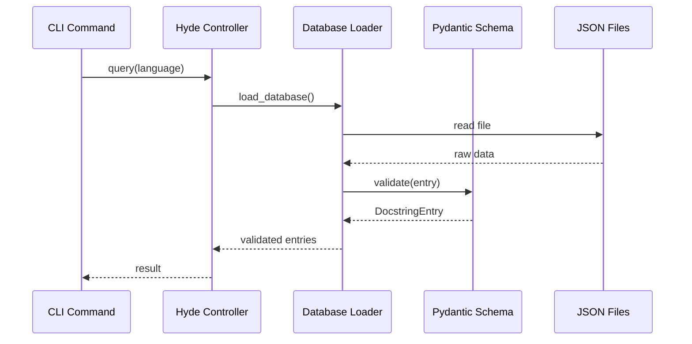

# Design Document: MRDR Data Population
[MRDR:doc:spec=doctags](/docs/doctags.md)

## Overview

The MRDR Data Population design focuses on creating and populating structured JSON databases that align with the documentation suite. This design extends the existing database infrastructure with new data sources while maintaining schema consistency and validation. The implementation follows the hyde → jekyl data flow pattern, with hyde managing data loading and jekyl consuming it for rendering.

## Architecture

### Database File Structure

```mermaid
flowchart TB
    subgraph DATABASE["database/"]
        subgraph DOCSTRINGS["docstrings/"]
            DS_JSON["docstring_database.json"]
            DS_MD["docstring_database.md"]
            DS_EX["docstring_examples.md"]
        end
        
        subgraph DOCTAGS["doctags/"]
            DT_JSON["doctag_database.json"]
        end
        
        subgraph DICTIONARY["dictionary/"]
            DICT_JSON["dictionary_database.json"]
        end
        
        subgraph CONFLICTS["conflicts/"]
            CONF_JSON["conflict_database.json"]
        end
        
        subgraph LANGUAGES["languages/"]
            subgraph PYTHON["python/"]
                PY_STYLES["python_styles.json"]
                PY_DOC["docstring_styles.md"]
            end
            subgraph UDL["udl/"]
                UDL_JSON["udl_database.json"]
                UDL_TMPL["udl_template.md"]
            end
            subgraph JS["javascript/"]
                JS_JSON["javascript_docstrings.json"]
            end
        end
    end
    
    LOADER["DatabaseLoader"] --> DS_JSON
    LOADER --> DT_JSON
    LOADER --> DICT_JSON
    LOADER --> CONF_JSON
    LOADER --> PY_STYLES
    LOADER --> UDL_JSON
```



### Data Flow Architecture



## Components and Interfaces

### Database Loader Extensions

```python
from pathlib import Path
from typing import Protocol, Any

class DatabaseSource(Protocol):
    """Protocol for database sources."""
    
    def load(self) -> list[dict[str, Any]]:
        """Load all entries from the source."""
        ...
    
    def get_entry(self, identifier: str) -> dict[str, Any] | None:
        """Get a single entry by identifier."""
        ...
    
    def list_identifiers(self) -> list[str]:
        """List all entry identifiers."""
        ...

# Database paths
DATABASE_PATHS = {
    "docstrings": Path("database/docstrings/docstring_database.json"),
    "doctags": Path("database/doctags/doctag_database.json"),
    "dictionary": Path("database/dictionary/dictionary_database.json"),
    "conflicts": Path("database/conflicts/conflict_database.json"),
    "python_styles": Path("database/languages/python/python_styles.json"),
    "udl": Path("database/languages/udl/udl_database.json"),
}
```

### Doctag Database Loader

```python
from dataclasses import dataclass
from enum import Enum
from pydantic import BaseModel, Field

class DoctagCategory(str, Enum):
    DDL = "DDL"  # Delimiters
    GRM = "GRM"  # Grammar
    IDC = "IDC"  # Inter-Document Commands
    FMT = "FMT"  # Formatting
    DOC = "DOC"  # Document Spec

class DoctagEntry(BaseModel):
    """Doctag database entry."""
    id: str = Field(..., pattern=r"^(DDL|GRM|IDC|FMT|DOC)\d{2}$")
    symbol: str = Field(..., description="The delimiter or symbol")
    short_name: str = Field(..., description="Short identifier (lowercase)")
    description: str = Field(..., description="Tag description")
    category: DoctagCategory = Field(..., description="Tag category")
    example: str | None = Field(None, description="Usage example")

@dataclass
class DoctagLoader:
    """Loader for doctag database."""
    
    database_path: Path = DATABASE_PATHS["doctags"]
    
    def load(self) -> list[DoctagEntry]:
        """Load all doctag entries."""
        ...
    
    def get(self, tag_id: str) -> DoctagEntry | None:
        """Get doctag by ID (e.g., DDL01, GRM05)."""
        ...
    
    def list_by_category(self, category: DoctagCategory) -> list[DoctagEntry]:
        """List all doctags in a category."""
        ...
```

### Dictionary Database Loader

```python
from dataclasses import dataclass, field
from enum import Enum

class HierarchyLevel(str, Enum):
    GRANDPARENT = "grandparent"
    PARENT = "parent"
    CHILD = "child"
    GRANDCHILD = "grandchild"

class DictionaryEntry(BaseModel):
    """Dictionary hierarchy entry."""
    name: str = Field(..., description="Term name (SCREAMINGSNAKE)")
    alias: str = Field(..., description="Short alias (lowercase)")
    level: HierarchyLevel = Field(..., description="Hierarchy level")
    description: str = Field(..., description="Term description")
    children: list[str] = Field(default_factory=list, description="Child term names")

class DictionaryDatabase(BaseModel):
    """Complete dictionary database."""
    version: str = Field(default="1.0.0")
    nametypes: list[DictionaryEntry] = Field(default_factory=list)
    definitions: list[DictionaryEntry] = Field(default_factory=list)
    grandparents: list[DictionaryEntry] = Field(default_factory=list)
    parents: list[DictionaryEntry] = Field(default_factory=list)
    children: list[DictionaryEntry] = Field(default_factory=list)
    grandchildren: list[DictionaryEntry] = Field(default_factory=list)

@dataclass
class DictionaryLoader:
    """Loader for dictionary database."""
    
    database_path: Path = DATABASE_PATHS["dictionary"]
    
    def load(self) -> DictionaryDatabase:
        """Load the complete dictionary database."""
        ...
    
    def get_term(self, name: str) -> DictionaryEntry | None:
        """Get a term by name or alias."""
        ...
    
    def get_hierarchy_path(self, name: str) -> list[DictionaryEntry]:
        """Get the path from root to the specified term."""
        ...
```

### Python Styles Database

```python
class PythonStyleMarker(BaseModel):
    """Marker used in a Python docstring style."""
    name: str = Field(..., description="Marker name (e.g., 'param')")
    syntax: str = Field(..., description="Marker syntax (e.g., ':param name:')")
    description: str = Field(..., description="What the marker documents")

class PythonStyleEntry(BaseModel):
    """Python docstring style entry."""
    name: str = Field(..., description="Style name (sphinx, google, numpy, epytext, pep257)")
    description: str = Field(..., description="Style description")
    markers: list[PythonStyleMarker] = Field(default_factory=list)
    template_code: str = Field(..., description="Example code with docstring")
    rules: list[str] = Field(default_factory=list, description="Style-specific rules")

class PythonStylesDatabase(BaseModel):
    """Python docstring styles database."""
    version: str = Field(default="1.0.0")
    styles: list[PythonStyleEntry] = Field(default_factory=list)
```

### Conflict Database

```python
class ConflictEntry(BaseModel):
    """Syntax conflict entry."""
    id: str = Field(..., description="Conflict identifier")
    delimiter: str = Field(..., description="The conflicting delimiter")
    languages: list[str] = Field(..., min_length=2, description="Languages sharing the delimiter")
    resolution: str = Field(..., description="How to resolve/distinguish")
    attachment_rules: dict[str, str] = Field(..., description="Language -> attachment rule mapping")

class ConflictDatabase(BaseModel):
    """Syntax conflicts database."""
    version: str = Field(default="1.0.0")
    conflicts: list[ConflictEntry] = Field(default_factory=list)
```

### UDL Database

```python
class UDLOperator(BaseModel):
    """UDL operator definition."""
    name: str = Field(..., description="Operator name")
    open: str = Field(..., min_length=2, max_length=2)
    close: str = Field(..., min_length=2, max_length=2)

class UDLEntry(BaseModel):
    """UDL template entry."""
    name: str = Field(..., description="UDL identifier")
    title: str = Field(..., description="Display title")
    description: str = Field(..., description="UDL description")
    language: str = Field(default="UDL", description="Target language")
    delimiter_open: str = Field(..., min_length=1, max_length=1)
    delimiter_close: str = Field(..., min_length=1, max_length=1)
    bracket_open: str = Field(default="(")
    bracket_close: str = Field(default=")")
    operators: list[UDLOperator] = Field(default_factory=list)
    examples: list[str] = Field(default_factory=list)

class UDLDatabase(BaseModel):
    """UDL templates database."""
    version: str = Field(default="1.0.0")
    templates: list[UDLEntry] = Field(default_factory=list)
```

## Data Models

### Extended Docstring Entry

```python
class SyntaxType(str, Enum):
    LITERAL = "literal"
    BLOCK = "block"
    LINE_SUGARED = "line_sugared"
    PADDED_BRACKET = "padded_bracket"
    MODULE_ATTRIBUTE = "module_attribute"
    NESTABLE_BLOCK = "nestable_block"
    PREFIX_LITERAL = "prefix_literal"
    HADDOCK_BLOCK = "haddock_block"
    POSITIONAL = "positional"
    LEADING_LINE = "leading_line"
    XML_STRUCTURED = "xml_structured"
    ATTRIBUTE_COMMENT = "attribute_comment"
    ARGUMENT_METADATA = "argument_metadata"
    POD_BLOCK = "pod_block"

class SyntaxLocation(str, Enum):
    INTERNAL_FIRST_LINE = "internal_first_line"
    ABOVE_TARGET = "above_target"
    ANYWHERE = "anywhere"
    COLUMN_7 = "column_7"
    COLUMN_1 = "column_1"
    AFTER_NAME = "after_name"

class PlusrepGrade(BaseModel):
    """PLUSREP quality grade."""
    tokens: str = Field(..., pattern=r"^[\+\.]{6}$")
    rating: int = Field(..., ge=-3, le=4)
    label: str = Field(...)

class SyntaxSpec(BaseModel):
    """Docstring syntax specification."""
    start: str
    end: str | None = None
    type: SyntaxType
    location: SyntaxLocation

class DocstringEntry(BaseModel):
    """Complete docstring database entry."""
    language: str
    syntax: SyntaxSpec
    tags: list[str] = Field(default_factory=list)
    example_content: str | None = None
    conflict_ref: str | None = None
    parsing_rule: str | None = None
    metadata: str | None = None
    plusrep: PlusrepGrade | None = None
```

### Database Manifest

```python
class DatabaseManifest(BaseModel):
    """Database file manifest."""
    manifest_name: str
    version: str
    schema_origin: str
    entry_count: int | None = None
    last_updated: str | None = None
```

## Error Handling

### Database-Specific Errors

```python
class DataPopulationError(MRDRError):
    """Base exception for data population errors."""
    pass

class DatabaseFileNotFoundError(DataPopulationError):
    """Database file not found."""
    def __init__(self, database_type: str, path: Path):
        self.database_type = database_type
        self.path = path
        super().__init__(f"{database_type} database not found: {path}")

class EntryNotFoundError(DataPopulationError):
    """Entry not found in database."""
    def __init__(self, database_type: str, identifier: str, suggestions: list[str]):
        self.database_type = database_type
        self.identifier = identifier
        self.suggestions = suggestions
        super().__init__(f"{identifier} not found in {database_type} database")

class SchemaValidationError(DataPopulationError):
    """Schema validation failed."""
    def __init__(self, database_type: str, entry_id: str, errors: list[str]):
        self.database_type = database_type
        self.entry_id = entry_id
        self.errors = errors
        super().__init__(f"Validation failed for {entry_id} in {database_type}: {errors}")
```

## Correctness Properties

*A property is a characteristic or behavior that should hold true across all valid executions of a system—essentially, a formal statement about what the system should do. Properties serve as the bridge between human-readable specifications and machine-verifiable correctness guarantees.*

### Property 1: Docstring Database Language Count

*For any* valid docstring database state, the number of language entries SHALL be at least 25.

**Validates: Requirements 1.1**

### Property 2: Docstring Entry Schema Validity

*For any* entry in the docstring database, the entry SHALL contain non-null values for: language, syntax.start, syntax.type, syntax.location.

**Validates: Requirements 1.2**

### Property 3: Conflict Reference Consistency

*For any* pair of languages in the docstring database with identical start delimiters, at least one entry SHALL have a conflict_ref field pointing to the other language.

**Validates: Requirements 1.4**

### Property 4: Doctag Category Completeness

*For any* doctag category (DDL, GRM, IDC, FMT, DOC), the doctag database SHALL contain all expected tag IDs: DDL01-DDL10, GRM01-GRM10, IDC01-IDC10, FMT01-FMT10, DOC01-DOC05.

**Validates: Requirements 2.2, 2.3, 2.4, 2.5, 2.6**

### Property 5: Doctag Entry Schema Validity

*For any* entry in the doctag database, the entry SHALL contain non-null values for: id, symbol, short_name, description, category.

**Validates: Requirements 2.7**

### Property 6: Dictionary Hierarchy Completeness

*For any* valid dictionary database, the database SHALL contain all defined terms at each level: grandparents (NOTE, CLAIM, LANG_USE, FORMAT, PURPOSE, RESTRICTIONS, STYLING, USER, NOTES), parents (apd, objacc), children (sem, def, dstr, rsch, stat, eg, vldt, expr, optml, unstbl, vislap, crtv), grandchildren (val, value).

**Validates: Requirements 3.2, 3.3, 3.4, 3.5**

### Property 7: Dictionary Entry Schema Validity

*For any* entry in the dictionary database, the entry SHALL contain non-null values for: name, alias, level, description.

**Validates: Requirements 3.6**

### Property 8: Dictionary NAMETYPE Definitions

*For any* valid dictionary database, the database SHALL contain NAMETYPE entries for CHD (CHILD), PNT (PARENT), GPN (GRANDPARENT) with correct hierarchical relationships.

**Validates: Requirements 3.7**

### Property 9: Python Style Completeness

*For any* valid Python styles database, the database SHALL contain all five styles (sphinx, google, numpy, epytext, pep257) with their characteristic markers: sphinx (:param:, :type:, :return:, :rtype:), google (Args:, Returns:), numpy (Parameters, Returns with dashes), epytext (@param, @type, @return).

**Validates: Requirements 4.2, 4.3, 4.4, 4.5, 4.6**

### Property 10: Python Style Entry Schema Validity

*For any* entry in the Python styles database, the entry SHALL contain non-null values for: name, description, markers, template_code, rules.

**Validates: Requirements 4.7**

### Property 11: UDL Operator Definitions

*For any* valid UDL database, the database SHALL contain dolphin operator with open=`<:` close=`:>` and walrus operator with open=`:=` close=`=:`.

**Validates: Requirements 5.3, 5.4**

### Property 12: UDL Entry Schema Validity

*For any* entry in the UDL database, the entry SHALL contain non-null values for: name, title, description, language, delimiter_open, delimiter_close.

**Validates: Requirements 5.5**

### Property 13: Conflict Entry Schema Validity

*For any* entry in the conflict database, the entry SHALL contain non-null values for: delimiter, languages (with at least 2 entries), resolution, attachment_rules.

**Validates: Requirements 6.5**

### Property 14: PLUSREP Consistency

*For any* plusrep grade in the database, the tokens SHALL be exactly 6 characters of `+` and `.`, the rating SHALL equal (count of '+') - 2, and the label SHALL match the rating (MAXIMUM for +4, GREAT for +2/+3, SLOPPY for 0, REJECTED for -2, RESET for -3).

**Validates: Requirements 7.1, 7.2, 7.3, 7.4**

### Property 15: Validation Error Handling

*For any* invalid database entry, the loader SHALL skip the entry without crashing and SHALL report the error with entry identifier and specific field failures.

**Validates: Requirements 8.1, 8.2, 8.3**

### Property 16: SCREAMINGSNAKE Case Compliance

*For any* tag identifier in the doctag database, the identifier SHALL match the pattern `^[A-Z][A-Z0-9_]*$` (SCREAMINGSNAKE case).

**Validates: Requirements 9.1**

### Property 17: Cross-Database Term Consistency

*For any* term that appears in multiple databases (e.g., language names in docstrings and conflicts), the term SHALL use identical spelling and casing across all occurrences.

**Validates: Requirements 9.3**

### Property 18: Example Content Canonical Format

*For any* docstring entry with non-null example_content, the content SHALL contain references to canonical payload fields (format, purpose, or user).

**Validates: Requirements 10.1, 10.2**

## Testing Strategy

### Dual Testing Approach

The MRDR Data Population will use both unit tests and property-based tests:

- **Unit tests**: Verify specific database files exist, contain expected entries, and load correctly
- **Property tests**: Verify universal properties across all database entries using Hypothesis

### Property-Based Testing Configuration

- **Library**: Hypothesis (Python)
- **Minimum iterations**: 100 per property test
- **Tag format**: `# Feature: mrdr-data-population, Property N: <property_text>`

### Test Organization

```
tests/
├── property/
│   ├── test_docstring_database.py      # Properties 1, 2, 3
│   ├── test_doctag_database.py         # Properties 4, 5, 16
│   ├── test_dictionary_database.py     # Properties 6, 7, 8
│   ├── test_python_styles.py           # Properties 9, 10
│   ├── test_udl_database.py            # Properties 11, 12
│   ├── test_conflict_database.py       # Property 13
│   ├── test_plusrep.py                 # Property 14
│   ├── test_validation.py              # Property 15
│   └── test_consistency.py             # Properties 17, 18
└── unit/
    ├── test_database_files.py          # File existence checks
    ├── test_loaders.py                 # Loader unit tests
    └── test_schemas.py                 # Schema validation tests
```

### Hypothesis Strategies

```python
from hypothesis import strategies as st

# Strategy for valid language names from expanded database
valid_languages = st.sampled_from([
    "Python", "JavaScript", "TypeScript", "Java", "Kotlin", "Scala",
    "PHP", "Swift", "Rust", "Zig", "C#", "F#", "Elixir", "Ruby",
    "Lua", "D", "Julia", "Haskell", "COBOL", "Raku", "Erlang",
    "Ada", "OCaml", "Clojure", "Fortran"
])

# Strategy for doctag IDs
doctag_ids = st.sampled_from([
    f"{cat}{num:02d}" 
    for cat in ["DDL", "GRM", "IDC", "FMT"] 
    for num in range(1, 11)
] + [f"DOC{num:02d}" for num in range(1, 6)])

# Strategy for PLUSREP tokens
plusrep_tokens = st.text(
    alphabet=['+', '.'],
    min_size=6,
    max_size=6
)

# Strategy for hierarchy levels
hierarchy_levels = st.sampled_from(["grandparent", "parent", "child", "grandchild"])

# Strategy for Python docstring styles
python_styles = st.sampled_from(["sphinx", "google", "numpy", "epytext", "pep257"])
```

### Example Property Test

```python
from hypothesis import given, settings
import hypothesis.strategies as st

@given(tokens=plusrep_tokens)
@settings(max_examples=100)
def test_plusrep_rating_calculation(tokens):
    """
    Feature: mrdr-data-population, Property 14: PLUSREP Consistency
    For any plusrep tokens, the rating SHALL equal (count of '+') - 2.
    """
    plus_count = tokens.count('+')
    expected_rating = plus_count - 2
    
    # Rating should be in valid range
    assert -2 <= expected_rating <= 4
    
    # Verify calculation
    grade = PlusrepGrade(tokens=tokens, rating=expected_rating, label=get_label(expected_rating))
    assert grade.rating == plus_count - 2
```
