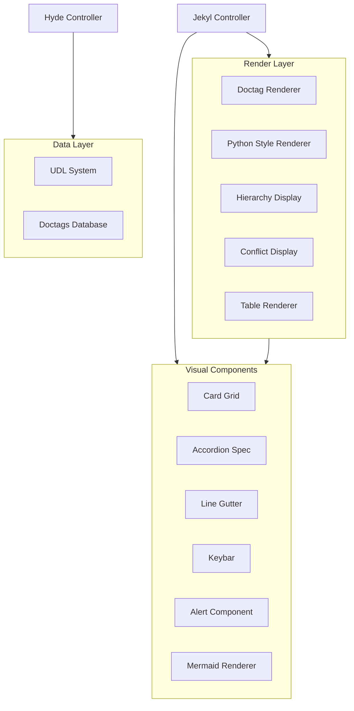

# Design Document: MRDR Visual Integration
[MRDR:doc:spec=doctags](/docs/doctags.md)

## Overview

The MRDR Visual Integration extends the CLI foundation with advanced visual patterns from the documentation suite. This design integrates the Visual Pattern Library, UDL (User Defined Language) system, doctag rendering, Python docstring styles, hierarchy display, Mermaid diagrams, alert components, conflict resolution, and comprehensive table rendering.

The architecture follows the existing hyde → jekyl data flow pattern, adding new render components and extending both controllers with visual-focused commands.

## Architecture

### Component Integration



### Module Structure Extension

```
src/mrdr/
├── render/
│   ├── components/
│   │   ├── card_grid.py        # Card grid layout
│   │   ├── accordion.py        # Accordion/details component
│   │   ├── line_gutter.py      # Line number gutter
│   │   ├── keybar.py           # Keybind display
│   │   ├── alert.py            # Alert panels (NOTE, TIP, etc.)
│   │   ├── mermaid.py          # Mermaid to ASCII converter
│   │   ├── hierarchy.py        # Hierarchy tree display
│   │   ├── conflict.py         # Conflict resolution display
│   │   └── table_advanced.py   # Advanced table with pagination
│   ├── doctag_renderer.py      # Doctag syntax highlighting
│   └── python_style.py         # Python docstring styles
├── database/
│   └── udl/
│       ├── __init__.py
│       ├── schema.py           # UDL Pydantic models
│       ├── loader.py           # UDL file loader
│       └── validator.py        # UDL validation
└── cli/
    ├── visual_commands.py      # Visual-specific commands
    └── udl_commands.py         # UDL management commands
```

## Components and Interfaces

### Card Grid Component

```python
from dataclasses import dataclass, field
from rich.table import Table
from rich.panel import Panel
from rich.console import Console

@dataclass
class CardData:
    """Data for a single card in the grid."""
    title: str
    purpose: str
    ui_description: str
    modes: list[str] = field(default_factory=list)
    details: str | None = None

@dataclass
class CardGrid:
    """Table-based card grid layout component."""
    
    cards: list[CardData]
    columns: int = 2
    
    def render(self, console: Console) -> str:
        """Render cards in a grid layout using Rich tables."""
        table = Table(show_header=False, box=None, padding=(0, 2))
        for _ in range(self.columns):
            table.add_column(width=40)
        
        # Group cards into rows
        for i in range(0, len(self.cards), self.columns):
            row_cards = self.cards[i:i + self.columns]
            panels = [self._render_card(card) for card in row_cards]
            table.add_row(*panels)
        
        with console.capture() as capture:
            console.print(table)
        return capture.get()
    
    def _render_card(self, card: CardData) -> Panel:
        """Render a single card as a Rich Panel."""
        content = f"[bold]{card.purpose}[/bold]\n"
        content += f"[dim]{card.ui_description}[/dim]\n"
        if card.modes:
            content += f"[cyan]Modes:[/cyan] {' · '.join(card.modes)}"
        return Panel(content, title=f"⌘ {card.title}", border_style="cyan")
```

### Line Gutter Component

```python
@dataclass
class LineGutter:
    """Line number gutter component for code display."""
    
    content: str
    start_line: int = 1
    separator: str = "│"
    
    def render(self, console: Console | None = None, plain: bool = False) -> str:
        """Render content with line number gutter."""
        lines = self.content.split("\n")
        total_lines = len(lines) + self.start_line - 1
        width = len(str(total_lines))
        
        result = []
        for i, line in enumerate(lines):
            line_num = self.start_line + i
            if plain:
                result.append(f"{line_num:>{width}}{self.separator} {line}")
            else:
                result.append(f"[dim]{line_num:>{width}}[/dim][dim]{self.separator}[/dim] {line}")
        
        return "\n".join(result)
```

### UDL System Schema

```python
from pydantic import BaseModel, Field, field_validator
from typing import Literal

class UDLOperator(BaseModel):
    """UDL operator definition."""
    name: str = Field(..., description="Operator name (e.g., 'dolphin', 'walrus')")
    open: str = Field(..., min_length=2, max_length=2, description="Opening delimiter")
    close: str = Field(..., min_length=2, max_length=2, description="Closing delimiter")

class UDLDefinition(BaseModel):
    """User Defined Language docstring definition."""
    title: str = Field(..., description="UDL title")
    description: str = Field(..., alias="descr", description="UDL description")
    language: str = Field(default="UDL", alias="lang", description="Target language")
    delimiter_open: str = Field(..., min_length=1, max_length=1, description="Opening delimiter")
    delimiter_close: str = Field(..., min_length=1, max_length=1, description="Closing delimiter")
    bracket_open: str = Field(default="(", description="Opening bracket")
    bracket_close: str = Field(default=")", description="Closing bracket")
    operators: list[UDLOperator] = Field(default_factory=list, description="Custom operators")
    
    @field_validator("delimiter_open", "delimiter_close")
    @classmethod
    def validate_single_char(cls, v: str) -> str:
        if len(v) != 1:
            raise ValueError("Delimiter must be exactly 1 character")
        return v

# Predefined operators
DOLPHIN_OPERATOR = UDLOperator(name="dolphin", open="<:", close=":>")
WALRUS_OPERATOR = UDLOperator(name="walrus", open=":=", close="=:")
```

### Doctag Renderer

```python
from dataclasses import dataclass
from rich.text import Text
from enum import Enum

class DoctagType(str, Enum):
    DELIMITER = "DDL"      # DDL01-DDL10
    GRAMMAR = "GRM"        # GRM01-GRM10
    INTER_DOC = "IDC"      # IDC01-IDC10
    FORMATTING = "FMT"     # FMT01-FMT10
    DOC_SPEC = "DOC"       # DOC01-DOC05

DOCTAG_COLORS = {
    DoctagType.DELIMITER: "yellow",
    DoctagType.GRAMMAR: "cyan",
    DoctagType.INTER_DOC: "blue underline",
    DoctagType.FORMATTING: "magenta",
    DoctagType.DOC_SPEC: "green",
}

@dataclass
class DoctagRenderer:
    """Renderer for doctag syntax with semantic coloring."""
    
    def render_tag(self, tag_id: str, tag_name: str, description: str) -> Text:
        """Render a single doctag with appropriate styling."""
        text = Text()
        tag_type = self._get_tag_type(tag_id)
        color = DOCTAG_COLORS.get(tag_type, "white")
        
        text.append(f"{tag_id}: ", style=f"bold {color}")
        text.append(f"`{tag_name}`", style="bold")
        text.append(f", `{tag_name.upper()}`", style="dim")
        text.append(f" - {description}", style="")
        
        return text
    
    def _get_tag_type(self, tag_id: str) -> DoctagType:
        """Determine tag type from ID prefix."""
        prefix = tag_id[:3]
        return DoctagType(prefix) if prefix in DoctagType._value2member_map_ else DoctagType.DOC_SPEC
```

### Python Style Renderer

```python
from dataclasses import dataclass
from enum import Enum
from rich.syntax import Syntax
from rich.panel import Panel

class PythonDocstringStyle(str, Enum):
    SPHINX = "sphinx"
    GOOGLE = "google"
    NUMPY = "numpy"
    EPYTEXT = "epytext"
    PEP257 = "pep257"

STYLE_TEMPLATES = {
    PythonDocstringStyle.SPHINX: '''
def my_function(name, age):
    """
    This is a brief description of the function.

    :param name: The name of the user.
    :type name: str
    :param age: The age of the user.
    :type age: int
    :return: A greeting message.
    :rtype: str
    """
    return f"Hello {name}, you are {age} years old."
''',
    PythonDocstringStyle.GOOGLE: '''
def my_function(name, age):
    """
    This is the module or function description.

    Args:
        name (str): The name of the user.
        age (int): The age of the user.

    Returns:
        str: A greeting message.
    """
    return f"Hello {name}, you are {age} years old."
''',
    PythonDocstringStyle.NUMPY: '''
def my_function(name, age):
    """
    Brief description.

    Parameters
    ----------
    name : str
        The name of the user.
    age : int
        The age of the user.

    Returns
    -------
    str
        A greeting message.
    """
    return f"Hello {name}, you are {age} years old."
''',
    PythonDocstringStyle.EPYTEXT: '''
def my_function(name, age):
    """
    Brief description.

    @param name: The name of the user.
    @type name: str
    @return: A greeting message.
    """
    return f"Hello {name}, you are {age} years old."
''',
    PythonDocstringStyle.PEP257: '''
def my_function():
    """
    Perform a simple task and return None.

    This multi-line section expands on the summary above if
    more context is required for the developer.
    """
    pass
''',
}

@dataclass
class PythonStyleRenderer:
    """Renderer for Python docstring styles."""
    
    def render_style(self, style: PythonDocstringStyle) -> Panel:
        """Render a specific Python docstring style."""
        template = STYLE_TEMPLATES[style]
        syntax = Syntax(template.strip(), "python", theme="monokai", line_numbers=True)
        return Panel(syntax, title=f"Python: {style.value.title()} Style", border_style="green")
    
    def render_all_styles(self) -> list[Panel]:
        """Render all Python docstring styles for comparison."""
        return [self.render_style(style) for style in PythonDocstringStyle]
```

### Alert Component

```python
from dataclasses import dataclass
from enum import Enum
from rich.panel import Panel
from rich.text import Text

class AlertType(str, Enum):
    NOTE = "note"
    TIP = "tip"
    IMPORTANT = "important"
    WARNING = "warning"
    CAUTION = "caution"

ALERT_CONFIG = {
    AlertType.NOTE: {"icon": "ℹ️", "color": "cyan", "title": "Note"},
    AlertType.TIP: {"icon": "💡", "color": "green", "title": "Tip"},
    AlertType.IMPORTANT: {"icon": "❗", "color": "magenta", "title": "Important"},
    AlertType.WARNING: {"icon": "⚠️", "color": "yellow", "title": "Warning"},
    AlertType.CAUTION: {"icon": "🛑", "color": "red", "title": "Caution"},
}

@dataclass
class AlertComponent:
    """Semantic alert message component."""
    
    alert_type: AlertType
    message: str
    
    def render(self) -> Panel:
        """Render the alert as a Rich Panel."""
        config = ALERT_CONFIG[self.alert_type]
        title = Text()
        title.append(f"{config['icon']} ", style="")
        title.append(config["title"], style=f"bold {config['color']}")
        
        return Panel(
            self.message,
            title=title,
            border_style=config["color"],
        )
    
    def render_plain(self) -> str:
        """Render the alert as plain text."""
        config = ALERT_CONFIG[self.alert_type]
        return f"[{config['title'].upper()}] {self.message}"
```

### Hierarchy Display Component

```python
from dataclasses import dataclass
from rich.tree import Tree
from rich.text import Text

class HierarchyLevel(str, Enum):
    GRANDPARENT = "grandparent"
    PARENT = "parent"
    CHILD = "child"
    GRANDCHILD = "grandchild"

HIERARCHY_STYLES = {
    HierarchyLevel.GRANDPARENT: "bold cyan",
    HierarchyLevel.PARENT: "bold green",
    HierarchyLevel.CHILD: "yellow",
    HierarchyLevel.GRANDCHILD: "dim",
}

@dataclass
class HierarchyNode:
    """A node in the hierarchy tree."""
    name: str
    alias: str
    level: HierarchyLevel
    description: str = ""
    children: list["HierarchyNode"] = None
    
    def __post_init__(self):
        if self.children is None:
            self.children = []

@dataclass
class HierarchyDisplay:
    """Component for rendering data hierarchies."""
    
    root: HierarchyNode
    
    def render(self) -> Tree:
        """Render the hierarchy as a Rich Tree."""
        tree = Tree(self._format_node(self.root))
        self._add_children(tree, self.root)
        return tree
    
    def _format_node(self, node: HierarchyNode) -> Text:
        """Format a single node with appropriate styling."""
        style = HIERARCHY_STYLES[node.level]
        text = Text()
        text.append(f"{node.name}", style=style)
        text.append(f" ({node.alias})", style="dim")
        if node.description:
            text.append(f" - {node.description}", style="italic")
        return text
    
    def _add_children(self, tree: Tree, node: HierarchyNode) -> None:
        """Recursively add children to the tree."""
        for child in node.children:
            branch = tree.add(self._format_node(child))
            self._add_children(branch, child)
```

### Conflict Display Component

```python
from dataclasses import dataclass
from rich.table import Table
from rich.panel import Panel
from rich.text import Text

@dataclass
class SyntaxConflict:
    """Represents a syntax conflict between languages."""
    languages: list[str]
    delimiter: str
    resolution: str
    attachment_rules: dict[str, str]  # language -> rule

@dataclass
class ConflictDisplay:
    """Component for displaying syntax conflicts."""
    
    conflicts: list[SyntaxConflict]
    
    def render_warning(self, language: str, conflict: SyntaxConflict) -> Panel:
        """Render a conflict warning panel for a specific language."""
        text = Text()
        text.append("⚠️ Syntax Conflict\n\n", style="bold yellow")
        text.append(f"Delimiter: ", style="dim")
        text.append(f"{conflict.delimiter}\n", style="bold")
        text.append(f"Also used by: ", style="dim")
        others = [l for l in conflict.languages if l != language]
        text.append(", ".join(others), style="cyan")
        text.append(f"\n\nResolution: ", style="dim")
        text.append(conflict.resolution, style="italic")
        
        return Panel(text, title="Conflict Warning", border_style="yellow")
    
    def render_table(self) -> Table:
        """Render all conflicts in a table."""
        table = Table(title="Syntax Conflicts", border_style="yellow")
        table.add_column("Delimiter", style="bold")
        table.add_column("Languages", style="cyan")
        table.add_column("Resolution", style="italic")
        
        for conflict in self.conflicts:
            table.add_row(
                conflict.delimiter,
                ", ".join(conflict.languages),
                conflict.resolution,
            )
        
        return table
```

### Mermaid Renderer

```python
from dataclasses import dataclass
import re

@dataclass
class MermaidRenderer:
    """Converts Mermaid diagrams to ASCII art representation."""
    
    def render(self, mermaid_source: str) -> str:
        """Convert Mermaid source to ASCII representation."""
        try:
            diagram_type = self._detect_type(mermaid_source)
            if diagram_type == "flowchart":
                return self._render_flowchart(mermaid_source)
            elif diagram_type == "sequence":
                return self._render_sequence(mermaid_source)
            else:
                return self._render_fallback(mermaid_source)
        except Exception:
            return self._render_fallback(mermaid_source)
    
    def _detect_type(self, source: str) -> str:
        """Detect the Mermaid diagram type."""
        if source.strip().startswith(("flowchart", "graph")):
            return "flowchart"
        elif source.strip().startswith("sequenceDiagram"):
            return "sequence"
        return "unknown"
    
    def _render_flowchart(self, source: str) -> str:
        """Render flowchart as ASCII boxes and arrows."""
        # Extract nodes and connections
        nodes = re.findall(r'(\w+)\["([^"]+)"\]', source)
        connections = re.findall(r'(\w+)\s*-->\s*(\w+)', source)
        
        result = []
        node_map = {n[0]: n[1] for n in nodes}
        
        for node_id, label in nodes:
            box_width = len(label) + 4
            result.append("┌" + "─" * box_width + "┐")
            result.append(f"│ {label} │")
            result.append("└" + "─" * box_width + "┘")
            result.append("       │")
            result.append("       ▼")
        
        return "\n".join(result[:-2])  # Remove trailing arrow
    
    def _render_sequence(self, source: str) -> str:
        """Render sequence diagram as ASCII."""
        participants = re.findall(r'participant\s+(\w+)', source)
        messages = re.findall(r'(\w+)->>(\w+):\s*(.+)', source)
        
        result = []
        # Header with participants
        header = "  ".join(f"[{p}]" for p in participants)
        result.append(header)
        result.append("  ".join("  │  " for _ in participants))
        
        for sender, receiver, msg in messages:
            result.append(f"  {sender} ──► {receiver}: {msg}")
        
        return "\n".join(result)
    
    def _render_fallback(self, source: str) -> str:
        """Fallback: display raw Mermaid source."""
        return f"```mermaid\n{source}\n```"
```

### Advanced Table Renderer

```python
from dataclasses import dataclass, field
from rich.table import Table
from rich.console import Console
from typing import Any, Callable

@dataclass
class TableConfig:
    """Configuration for advanced table rendering."""
    columns: list[str] | None = None
    filter_field: str | None = None
    filter_value: str | None = None
    sort_field: str | None = None
    sort_descending: bool = False
    page_size: int = 20
    current_page: int = 1

@dataclass
class AdvancedTableRenderer:
    """Advanced table renderer with filtering, sorting, and pagination."""
    
    data: list[dict[str, Any]]
    config: TableConfig = field(default_factory=TableConfig)
    
    def render(self, console: Console) -> str:
        """Render the table with all configured options."""
        filtered_data = self._apply_filter()
        sorted_data = self._apply_sort(filtered_data)
        paginated_data, total_pages = self._apply_pagination(sorted_data)
        
        table = self._build_table(paginated_data)
        
        with console.capture() as capture:
            console.print(table)
            if total_pages > 1:
                console.print(self._render_pagination_hints(total_pages))
        
        return capture.get()
    
    def _apply_filter(self) -> list[dict]:
        """Apply row filtering."""
        if not self.config.filter_field or not self.config.filter_value:
            return self.data
        return [
            row for row in self.data
            if str(row.get(self.config.filter_field, "")).lower() == self.config.filter_value.lower()
        ]
    
    def _apply_sort(self, data: list[dict]) -> list[dict]:
        """Apply sorting."""
        if not self.config.sort_field:
            return data
        return sorted(
            data,
            key=lambda x: str(x.get(self.config.sort_field, "")),
            reverse=self.config.sort_descending,
        )
    
    def _apply_pagination(self, data: list[dict]) -> tuple[list[dict], int]:
        """Apply pagination and return (page_data, total_pages)."""
        total_pages = (len(data) + self.config.page_size - 1) // self.config.page_size
        start = (self.config.current_page - 1) * self.config.page_size
        end = start + self.config.page_size
        return data[start:end], max(1, total_pages)
    
    def _build_table(self, data: list[dict]) -> Table:
        """Build the Rich table."""
        if not data:
            return Table(title="No data")
        
        columns = self.config.columns or list(data[0].keys())
        table = Table(title="Master Docstring Table", border_style="cyan")
        
        for col in columns:
            table.add_column(col.title(), style="bold")
        
        for row in data:
            table.add_row(*[str(row.get(col, "")) for col in columns])
        
        return table
    
    def _render_pagination_hints(self, total_pages: int) -> str:
        """Render pagination navigation hints."""
        return f"Page {self.config.current_page}/{total_pages} | (n) next · (p) prev · (g) goto"
    
    def export_markdown(self) -> str:
        """Export table as markdown format."""
        if not self.data:
            return "| No data |"
        
        columns = self.config.columns or list(self.data[0].keys())
        lines = []
        
        # Header
        lines.append("| " + " | ".join(columns) + " |")
        lines.append("| " + " | ".join("---" for _ in columns) + " |")
        
        # Rows
        for row in self.data:
            lines.append("| " + " | ".join(str(row.get(col, "")) for col in columns) + " |")
        
        return "\n".join(lines)
```

## Data Models

### UDL Entry Model

```python
class UDLEntry(BaseModel):
    """Complete UDL database entry."""
    name: str = Field(..., description="UDL identifier name")
    definition: UDLDefinition = Field(..., description="UDL definition")
    examples: list[str] = Field(default_factory=list, description="Example usages")
    created_at: str = Field(..., description="Creation timestamp")
    
    class Config:
        use_enum_values = True
```

### Doctag Entry Model

```python
class DoctagEntry(BaseModel):
    """Doctag database entry."""
    id: str = Field(..., pattern=r"^(DDL|GRM|IDC|FMT|DOC)\d{2}$")
    short_name: str = Field(..., description="Short identifier")
    full_name: str = Field(..., description="Full identifier name")
    description: str = Field(..., description="Tag description")
    example: str | None = Field(None, description="Usage example")
    category: DoctagType = Field(..., description="Tag category")
```

## Error Handling

### Visual Component Errors

```python
class VisualError(MRDRError):
    """Base exception for visual component errors."""
    pass

class RenderError(VisualError):
    """Rendering failed."""
    def __init__(self, component: str, reason: str):
        self.component = component
        self.reason = reason
        super().__init__(f"Failed to render {component}: {reason}")

class UDLError(MRDRError):
    """UDL-related errors."""
    pass

class UDLValidationError(UDLError):
    """UDL validation failed."""
    def __init__(self, field: str, value: str, expected: str):
        self.field = field
        self.value = value
        self.expected = expected
        super().__init__(f"Invalid {field}: '{value}' (expected {expected})")

class UDLNotFoundError(UDLError):
    """UDL definition not found."""
    def __init__(self, name: str, available: list[str]):
        self.name = name
        self.available = available
        super().__init__(f"UDL '{name}' not found. Available: {', '.join(available)}")

class MermaidRenderError(VisualError):
    """Mermaid rendering failed."""
    def __init__(self, diagram_type: str):
        self.diagram_type = diagram_type
        super().__init__(f"Failed to render Mermaid {diagram_type} diagram")
```

## Correctness Properties

*A property is a characteristic or behavior that should hold true across all valid executions of a system—essentially, a formal statement about what the system should do. Properties serve as the bridge between human-readable specifications and machine-verifiable correctness guarantees.*

### Property 1: Card Grid Layout Structure

*For any* valid card data, rendering with `--card` flag SHALL produce output containing table structure with card panels for each entry.

**Validates: Requirements 1.1, 1.2**

### Property 2: Accordion Expandable Sections

*For any* content rendered with `--accordion` flag, the output SHALL contain Rich panel markers indicating expandable sections.

**Validates: Requirements 1.3, 1.4**

### Property 3: Keybar Keycap Formatting

*For any* keybind hint rendered by Keybar_Component, the output SHALL contain kbd-style formatting markers around key characters.

**Validates: Requirements 1.5**

### Property 4: Line Gutter Number Alignment

*For any* content with N lines rendered with `--gutter` flag, line numbers SHALL be right-justified to width of N, separated by `|` from content.

**Validates: Requirements 2.1, 2.2, 2.5**

### Property 5: Line Gutter Plain Mode

*For any* content rendered with both `--gutter` and `--plain` flags, the output SHALL contain line numbers but zero ANSI escape sequences.

**Validates: Requirements 2.3**

### Property 6: Line Gutter Start Line

*For any* start line value N, rendering with `--start-line N` SHALL produce output where first line number equals N.

**Validates: Requirements 2.4**

### Property 7: UDL Operator Pattern Support

*For any* UDL definition using dolphin (`<:`, `:>`) or walrus (`:=`, `=:`) operators, the UDL_System SHALL correctly parse and render the operator patterns.

**Validates: Requirements 3.3, 3.4**

### Property 8: UDL Delimiter Validation

*For any* UDL definition, DELIMITER fields SHALL be exactly 1 character and OPERATOR fields SHALL be exactly 2 characters; invalid values SHALL be rejected.

**Validates: Requirements 3.6**

### Property 9: UDL List Completeness

*For any* set of registered UDL definitions, `mrdr hyde udl list` SHALL return a list containing all UDL names with no duplicates or omissions.

**Validates: Requirements 3.7**

### Property 10: Doctag Token Rendering

*For any* doctag token (DDL, GRM, IDC, FMT), the Doctag_Renderer SHALL apply semantic coloring based on token type and render identifiers in SCREAMINGSNAKE case.

**Validates: Requirements 4.1, 4.2, 4.3, 4.4, 4.6**

### Property 11: Doctag Lookup Display

*For any* valid tag_id, `mrdr jekyl doctag <tag_id>` SHALL display the tag definition including short name, full name, description, and example if present.

**Validates: Requirements 4.5**

### Property 12: Python Style Format Compliance

*For any* Python docstring style (sphinx, google, numpy, epytext, pep257), the rendered output SHALL contain the style-specific markers: `:param:` for sphinx, `Args:` for google, `Parameters\n----------` for numpy, `@param` for epytext.

**Validates: Requirements 5.1, 5.2, 5.3, 5.4, 5.5, 5.7**

### Property 13: Hierarchy Level Indentation

*For any* hierarchy tree, grandparent nodes SHALL have zero indentation, parent nodes SHALL have 1-level indentation, child nodes SHALL have 2-level indentation, and grandchild nodes SHALL have 3-level indentation.

**Validates: Requirements 6.1, 6.2, 6.3, 6.5**

### Property 14: Hierarchy Term Lookup

*For any* term in the dictionary hierarchy, `mrdr hyde hierarchy <term>` SHALL display the term's position showing its level and ancestors.

**Validates: Requirements 6.4**

### Property 15: Mermaid Flowchart Rendering

*For any* valid Mermaid flowchart source with LR or TB direction, the Mermaid_Renderer SHALL produce ASCII output containing box characters and arrow indicators.

**Validates: Requirements 7.1, 7.2**

### Property 16: Mermaid Sequence Rendering

*For any* valid Mermaid sequence diagram, the Mermaid_Renderer SHALL produce output containing participant names and message arrows.

**Validates: Requirements 7.3**

### Property 17: Mermaid Fallback

*For any* invalid or unsupported Mermaid source, the Mermaid_Renderer SHALL return the raw source wrapped in mermaid code fence markers.

**Validates: Requirements 7.4**

### Property 18: Alert Type Styling

*For any* alert type (NOTE, TIP, IMPORTANT, WARNING, CAUTION), the Alert_Component SHALL render with the correct icon, color, and title as defined in ALERT_CONFIG.

**Validates: Requirements 8.1, 8.2, 8.3, 8.4, 8.5, 8.6**

### Property 19: Conflict Information Completeness

*For any* language with `conflict_ref`, the conflict display SHALL show: warning panel, list of conflicting languages, attachment rule differences, and resolution guidance.

**Validates: Requirements 9.1, 9.2, 9.3, 9.5**

### Property 20: Conflict Table Display

*For any* invocation of `mrdr jekyl conflicts`, the output SHALL contain a table with all known syntax conflicts including delimiter, languages, and resolution columns.

**Validates: Requirements 9.4**

### Property 21: Master Table Completeness

*For any* invocation of `mrdr jekyl table --master`, the output SHALL contain all languages from the database in table format.

**Validates: Requirements 10.1**

### Property 22: Table Column Filtering

*For any* `--columns` option with column list, the rendered table SHALL contain only the specified columns in the specified order.

**Validates: Requirements 10.2**

### Property 23: Table Row Filtering

*For any* `--filter field=value` option, the rendered table SHALL contain only rows where the specified field matches the value.

**Validates: Requirements 10.3**

### Property 24: Table Sorting

*For any* `--sort field` option, the rendered table rows SHALL be ordered by the specified field in ascending order (or descending with toggle).

**Validates: Requirements 10.4**

### Property 25: Table Pagination

*For any* table with rows exceeding page_size, the output SHALL include pagination hints showing current page and navigation options.

**Validates: Requirements 10.5**

### Property 26: Table Markdown Export

*For any* `--export md` option, the output SHALL be valid GitHub-Flavored Markdown table syntax with header, separator, and data rows.

**Validates: Requirements 10.6**

## Testing Strategy

### Dual Testing Approach

The MRDR Visual Integration will use both unit tests and property-based tests:

- **Unit tests**: Verify specific examples, edge cases, and error conditions for visual components
- **Property tests**: Verify universal properties across all valid inputs using Hypothesis

### Property-Based Testing Configuration

- **Library**: Hypothesis (Python)
- **Minimum iterations**: 100 per property test
- **Tag format**: `# Feature: mrdr-visual-integration, Property N: <property_text>`

### Test Organization

```
tests/
├── property/
│   ├── test_card_grid.py           # Properties 1
│   ├── test_accordion.py           # Property 2
│   ├── test_keybar.py              # Property 3
│   ├── test_line_gutter.py         # Properties 4, 5, 6
│   ├── test_udl_system.py          # Properties 7, 8, 9
│   ├── test_doctag_renderer.py     # Properties 10, 11
│   ├── test_python_styles.py       # Property 12
│   ├── test_hierarchy.py           # Properties 13, 14
│   ├── test_mermaid.py             # Properties 15, 16, 17
│   ├── test_alerts.py              # Property 18
│   ├── test_conflicts.py           # Properties 19, 20
│   └── test_table_advanced.py      # Properties 21, 22, 23, 24, 25, 26
└── unit/
    ├── test_visual_components.py   # Unit tests for visual components
    ├── test_udl_validation.py      # UDL validation edge cases
    └── test_renderers.py           # Renderer unit tests
```

### Hypothesis Strategies

```python
from hypothesis import strategies as st

# Strategy for valid UDL names
udl_names = st.text(
    alphabet=st.characters(whitelist_categories=("L", "N")),
    min_size=1,
    max_size=30,
)

# Strategy for single-character delimiters
single_char_delimiter = st.text(min_size=1, max_size=1)

# Strategy for two-character operators
two_char_operator = st.text(min_size=2, max_size=2)

# Strategy for alert types
alert_types = st.sampled_from(["note", "tip", "important", "warning", "caution"])

# Strategy for Python docstring styles
python_styles = st.sampled_from(["sphinx", "google", "numpy", "epytext", "pep257"])

# Strategy for hierarchy levels
hierarchy_levels = st.sampled_from(["grandparent", "parent", "child", "grandchild"])

# Strategy for table filter operations
table_filters = st.tuples(
    st.sampled_from(["language", "syntax.type", "tags"]),
    st.text(min_size=1, max_size=20),
)

# Strategy for Mermaid diagram types
mermaid_types = st.sampled_from(["flowchart", "sequence"])
```

### Example Property Test

```python
from hypothesis import given, settings
import hypothesis.strategies as st

@given(style=python_styles)
@settings(max_examples=100)
def test_python_style_format_compliance(style):
    """
    Feature: mrdr-visual-integration, Property 12: Python Style Format Compliance
    For any Python docstring style, the rendered output SHALL contain
    the style-specific markers.
    """
    renderer = PythonStyleRenderer()
    output = renderer.render_style(PythonDocstringStyle(style))
    
    markers = {
        "sphinx": ":param:",
        "google": "Args:",
        "numpy": "Parameters\n",
        "epytext": "@param",
        "pep257": '"""',
    }
    
    assert markers[style] in str(output)
```
