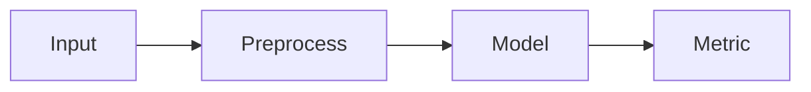

# Research Notes — <PROJECT / PAPER TITLE>
[MRDR:doc:spec=doctags](/docs/doctags.md)

> [!NOTE]
> What this note is about in a single sentence.

---

## Quick Metadata (front-matter-ish)

| Field | Value |
|---|---|
| Date | YYYY-MM-DD |
| Topic | <e.g., causal inference / retrieval / compilers> |
| Status | ☐ idea ☐ reading ☐ replicating ☐ drafting ☐ done |
| Source | <DOI / arXiv / URL / “internal doc”> |
| Tags | `#tag1` `#tag2` `#tag3` |
| Related | #123 (issue), PR #456, `repo@sha` |

---

## TL;DR

> [!IMPORTANT]
> **Claim:** <What the author(s) claim.>  
> **My take:** <Do I believe it? why/why not?>  
> **So what:** <Why it matters / what it enables.>

---

## Research Question

- **Question:** <What exactly am I trying to answer?>
- **Hypothesis:** <What do I expect to be true?>
- **Success criteria:** <What would “proved enough” look like?>

---

## Key Definitions

- **Term A:** <definition>
- **Term B:** <definition>
- **Assumptions:** <explicit assumptions; list them>

---

## Evidence Ledger (what supports what)

> [!TIP]
> Keep this section brutally concrete: *what was measured, how, and what it implies*.

- **Evidence 1 → supports:** <claim>  
  - Where: <section/figure/table>  
  - Notes: <why this matters>

- **Evidence 2 → weakens:** <claim>  
  - Where: <section/figure/table>  
  - Notes: <what breaks / uncertainty>

---

## Method Snapshot

| Component | Choice | Notes |
|---|---|---|
| Data | <dataset / sample> | <filters, time span> |
| Model | <architecture / estimator> | <hyperparams> |
| Metrics | <metric list> | <why these> |
| Baselines | <baseline list> | <fairness notes> |
| Compute | <hw / runtime> | <seed policy> |

---

## Core Equations / Algorithm

$$
\text{(Put the main equation here)}
$$

<details>
<summary>Derivation / notes (expand)</summary>

- Step 1: …
- Step 2: …
- Edge cases: …

</details>

<details>
<summary>Pseudocode (expand)</summary>

```pseudo
for each batch:
  preprocess
  forward
  compute loss
  update
````

</details>

---

## Experiments

### Experiment A — <name>

- **Purpose:** <what this isolates>
- **Setup:** <data split, controls, hyperparams>
- **Result:** <single sentence outcome>
- **Interpretation:** <what it means>

<details>
<summary>Logs / raw output</summary>

```text
paste logs here
```

</details>

### Experiment B — <name>

(Repeat)

---

## Results Table (copy-friendly)

| Variant    | Metric 1 | Metric 2 | Cost | Notes |
| ---------- | -------: | -------: | ---: | ----- |
| Baseline   |          |          |      |       |
| Proposed   |          |          |      |       |
| Ablation 1 |          |          |      |       |

---

## Figures / Diagrams



<picture>
  <source media="(prefers-color-scheme: dark)" srcset="fig-dark.png">
  
</picture>

---

## Failure Modes & Caveats

> [!WARNING]
> **Known risks / likely confounds:** <list them plainly>

- Failure mode 1: <what happens, when>
- Failure mode 2: <what happens, when>

---

## Decisions / Next Actions

- **Decision:** <what I’m choosing to do>

  - Rationale: <why>
  - Tradeoff: <what I’m giving up>

---

## Checklist (default workflow)

- [ ] Identify the *single* core claim
- [ ] Extract definitions + assumptions
- [ ] Record the strongest evidence (figure/table/section)
- [ ] Reproduce baseline (or validate with proxy)
- [ ] Run 1 ablation that could falsify the claim
- [ ] Document failure cases
- [ ] Write “what I’d do next” in 3 bullets

---

## References (Footnotes)

Main citation goes here.[^1] Supporting claim citation.[^2]

[^1]: <Full citation: Authors (Year). Title. Venue. DOI/URL.>

[^2]: <Full citation or URL + “accessed YYYY-MM-DD”.>
