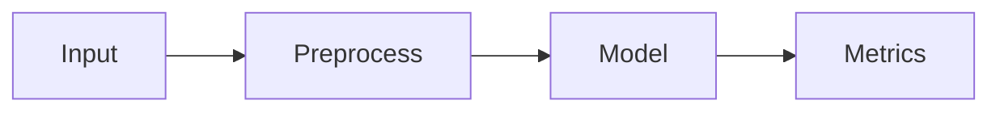

# GitHub Markdown Power-Features Reference (for research notes)
[MRDR:doc:spec=doctags](/docs/doctags.md)

A curated list of **GitHub-rendered** formatting features that go beyond “basic Markdown” (bold/italic/bullets). Everything below is supported in GitHub’s renderer **in at least one of**: `.md` files, Issues, PRs, Discussions, Wikis.

---

## Alerts (callouts / admonitions)

GitHub supports 5 alert types using blockquote syntax. ([GitHub Docs][1])

```md
> [!NOTE]
> Quick context that’s safe to skim.

> [!TIP]
> A better way to do it.

> [!IMPORTANT]
> Don’t miss this.

> [!WARNING]
> This can break things.

> [!CAUTION]
> Risky / high-stakes outcomes.
```

Notes:

* Alerts **cannot be nested** and GitHub recommends using them sparingly. ([GitHub Docs][1])

---

## Collapsible sections (foldable blocks)

Use HTML `<details>` + `<summary>` to hide big chunks (derivations, raw logs, long tables). ([GitHub Docs][2])

```md
<details>
<summary>Derivation (click to expand)</summary>

### Step 1
Math, code, tables… all render inside.

</details>
```

Open by default: ([GitHub Docs][2])

```md
<details open>
<summary>Expanded by default</summary>

Visible immediately.

</details>
```

---
## 2. Structural & Interactive Elements

To keep your research notes from becoming a "wall of text," use these structural tools to organize data and hide complex derivations.

### Collapsible Details (Accordions)

Ideal for hiding lengthy proofs, raw data, or supplementary code that you don't need to see every time you open the file.

<details>
<summary><b>Click to expand: Mathematical Derivation</b></summary>

Here you can place your complex  formulas or long-form descriptions that otherwise clutter the page.

</details>

### Advanced Tables

While standard tables exist, you can use **alignment** and **HTML-in-Markdown** to create cleaner looks. You can also use empty headers for a more "minimalist" data grid.

| Variable | Definition | Unit |
| --- | --- | --- |
|     | Learning Rate | unitless |
|  | Time Interval |  |

> prettified version

| Variable | Definition | Unit     |
| --- | --------------- | -------- |
|     | Learning Rate   | unitless |
|     | Time Interval   |          |

---

## 5. Metadata and Aesthetic "Hacks"

### Keyboard Keys (`<kbd>`)

If your research involves specific software workflows, use the `<kbd>` tag to make shortcuts stand out.

* To run the simulation, press <kbd>Ctrl</kbd> + <kbd>R</kbd>.

### Syntax Highlighting with Line Highlighting

When documenting scripts, always specify the language for proper color-coding.

```python
def research_function(data):
    # This comment is styled differently than the code
    return [x**2 for x in data]

```

### Colored Text (The Diff Hack)

GitHub doesn't natively support colored text via standard Markdown, but you can use `diff` code blocks to highlight "added" (green) or "removed" (red) concepts in your notes.

```diff
+ Key Finding: The results were statistically significant.
- Old Theory: The previous assumption was incorrect.

```

---

## 6. Footnotes for Citations

Keep research clean by using academic-style footnotes that link to the bottom of the document.

The study of quantum entanglement is ongoing[^1].

---

## Diagrams inside Markdown

GitHub renders diagrams from **four syntaxes**: `mermaid`, `geojson`, `topojson`, `stl` (ASCII STL). ([GitHub Docs][3])

### Mermaid

````md
```mermaid
graph TD;
  A-->B;
  A-->C;
  B-->D;
  C-->D;
````

````
:contentReference[oaicite:5]{index=5}

### GeoJSON / TopoJSON maps
```md
```geojson
{ "type": "FeatureCollection", "features": [] }
````

````
:contentReference[oaicite:6]{index=6}

### 3D models (ASCII STL)
```md
```stl
solid name
endsolid name
````

````
:contentReference[oaicite:7]{index=7}

---

## LaTeX math (MathJax)

Math renders in `.md` files, Issues, PRs, Discussions, and Wikis. :contentReference[oaicite:8]{index=8}

Inline:
```md
We use $\sqrt{3x-1}+(1+x)^2$ for the transform.
````

Blocks:

```md
$$
\mathcal{L} = \sum_i (y_i - \hat{y}_i)^2
$$
```

([GitHub Docs][4])

---

## Footnotes

Footnotes render at the bottom (but **not in wikis**). ([GitHub Docs][1])

```md
This claim matches prior work.[^1]

[^1]: Full citation / note text.
```

([GitHub Docs][1])

---

## Fenced code blocks + syntax highlighting tricks

### Fenced blocks

````md
```python
print("hello")
````

````
:contentReference[oaicite:12]{index=12}

### Show literal backticks (quad fences)
```md
````

```
Look! literal backticks
```

````
```
:contentReference[oaicite:13]{index=13}

GitHub uses Linguist grammars to pick highlighting languages. :contentReference[oaicite:14]{index=14}

---

## Autolinked references (smart linking)

GitHub automatically links and shortens:
- URLs
- Issues / PRs
- Labels (same repo)
- Commit SHAs and `owner/repo@sha`
- Plus optional **custom autolinks** configured by repo admins :contentReference[oaicite:15]{index=15}

Example (commits): :contentReference[oaicite:16]{index=16}
```md
Fix landed in a5c3785ed8d6a35868bc169f07e40e889087fd2e
```

---

## Mentions + issue/PR inline lookup

### Mention people/teams
```md
@org/team can review Section 3.
```
:contentReference[oaicite:17]{index=17}

### Reference issues/PRs with `#`
Typing `#` in GitHub editors brings suggestions you can autocomplete. :contentReference[oaicite:18]{index=18}

---

## Task lists (checkboxes)

Checkbox list items render with clickable boxes. :contentReference[oaicite:19]{index=19}

```md
- [ ] Replicate baseline
- [x] Verify preprocessing
- [ ] Write ablation notes
```

Important nuance:
- **“Tasklist blocks” are retired** (a specific issue feature), but **Markdown checkboxes** still work and “issue tasklists” have extra behavior when placed in an issue body. :contentReference[oaicite:20]{index=20}

---

## Section links + auto Table of Contents

- Headings become linkable anchors, and GitHub can show an auto TOC in the file header when you have multiple headings. :contentReference[oaicite:21]{index=21}

---

## Images + attachments (plus “responsive” images)

### Relative image links (recommended)
GitHub supports relative paths for repo-hosted images. :contentReference[oaicite:22]{index=22}

### Responsive images with `<picture>`
`<picture>` is supported (swap images for light/dark mode). :contentReference[oaicite:23]{index=23}

```md
<picture>
  <source media="(prefers-color-scheme: dark)" srcset="dark.png">
  
</picture>
```

### Attach files by drag & drop / paste
Works in `.md` editing and conversations; GitHub uploads and inserts a link. :contentReference[oaicite:24]{index=24}

---

## Color “chips” (inline color previews)

In Issues/PRs/Discussions, a supported color value inside backticks shows a preview (HEX/RGB/HSL). :contentReference[oaicite:25]{index=25}

```md
Primary color is `#0969DA` and accent is `hsl(212, 92%, 45%)`.
```

---

## Hidden content (HTML comments)

Great for private annotations, “notes to self,” or future sections. :contentReference[oaicite:26]{index=26}

```md
<!-- hidden: raw scratch notes, not rendered -->
```

---

## Escaping formatting + controlled line breaks

### Escape Markdown characters
```md
Let's rename \*new\* to \*old\*.
```
:contentReference[oaicite:27]{index=27}

### Hard line breaks in `.md` files
Use **two trailing spaces**, a **backslash**, or `<br/>`. :contentReference[oaicite:28]{index=28}

---

## “Citation-grade” links to exact lines (great for research notes)

You can link to a specific line/range with `#L##` (and ranges like `#L10-L25`). :contentReference[oaicite:29]{index=29}

---

# Ready-to-steal layout snippets

## 1) Experiment / Paper “Card”
```md
> [!IMPORTANT]
> **Claim:** …
> **Evidence:** …
> **Risk:** …

<details>
<summary>Method + Parameters</summary>

- Dataset: …
- Seed: …
- Notes: …

</details>

$$
\text{Key equation here}
$$

[^ref]: Full citation / URL / DOI note.
```

## 2) Results “Fold” with Mermaid
```md
<details>
<summary>Pipeline overview</summary>



</details>
```

## 3) Checklist-driven iteration
```md
> [!NOTE]
> Current status: **replication in progress**

- [ ] Baseline reproduced
- [ ] Ablations
- [ ] Failure cases documented
- [ ] Writeup polished
```

---

If you want, I can also produce a **single-page “research notes template”** that bakes these into a consistent structure (front-matter-ish header, collapsible derivations, citation style via footnotes, and a default checklist).
::contentReference[oaicite:30]{index=30}
````

[1]: https://docs.github.com/github/writing-on-github/getting-started-with-writing-and-formatting-on-github/basic-writing-and-formatting-syntax "Basic writing and formatting syntax - GitHub Docs"
[2]: https://docs.github.com/en/get-started/writing-on-github/working-with-advanced-formatting/organizing-information-with-collapsed-sections "Organizing information with collapsed sections - GitHub Docs"
[3]: https://docs.github.com/en/get-started/writing-on-github/working-with-advanced-formatting/creating-diagrams "Creating diagrams - GitHub Docs"
[4]: https://docs.github.com/en/get-started/writing-on-github/working-with-advanced-formatting/writing-mathematical-expressions "Writing mathematical expressions - GitHub Docs"
