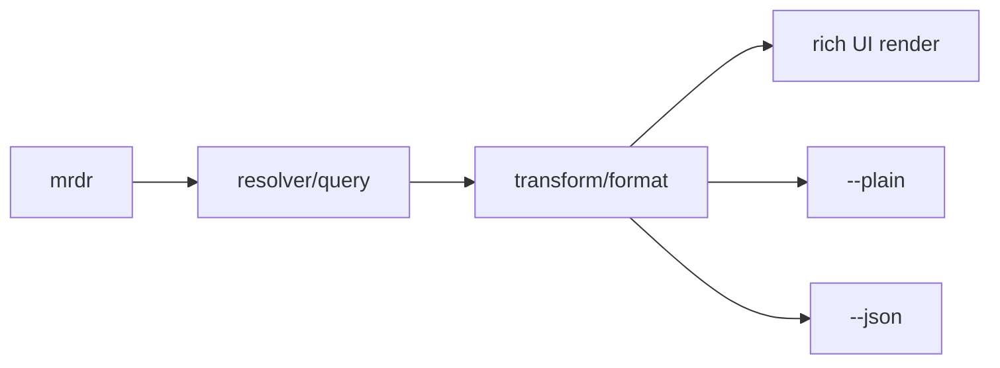
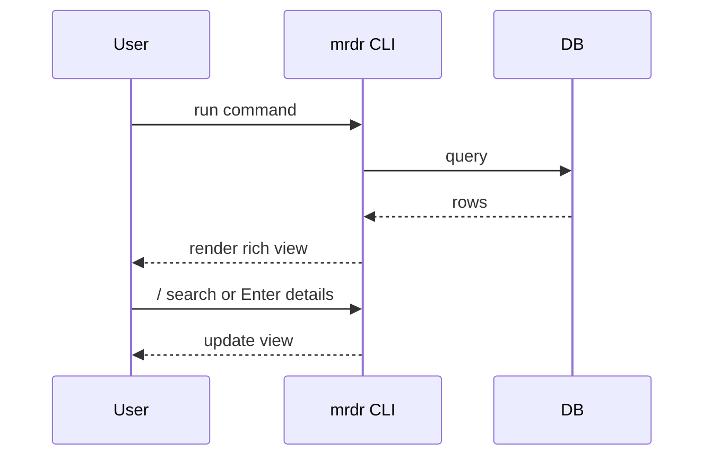
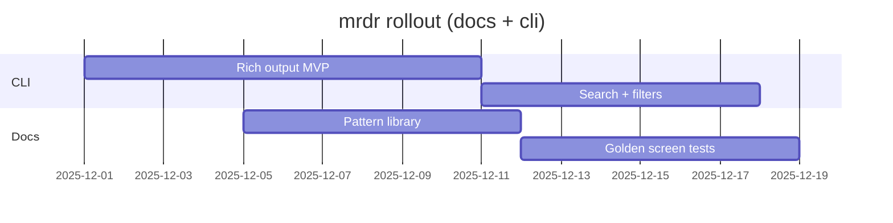

<!--
MRDR / GITHUB DOCS — RARE VISUAL INTEGRATIONS PATTERN LIBRARY
Goal: docs that feel like the CLI: interactive, modern, scan-first, “extra step” visuals.
-->
# mrdr Docs: Visual Pattern Library
<sub>GitHub-Flavored Markdown patterns for “rich CLI UI” documentation.</sub>

---

## Jump Table (like a CLI help index)

- [Theme-aware hero](#️-theme-aware-hero)
- [Card grid layouts](#-card-grid-layouts)
- [Accordion specs](#-accordion-specs)
- [Pseudo-tabs (no JS)](#-pseudo-tabs-no-js)
- [Alerts as UI primitives](#-alerts-as-ui-primitives)
- [Keybar + keycaps](#-keybar--keycaps)
- [Golden output “screens”](#-golden-output-screens)
- [GeoJSON/TopoJSON embeds](#️-geojsontopojson-embeds)
- [STL 3D preview embeds](#-stl-3d-preview-embeds)
- [Mermaid diagram gallery](#-mermaid-diagram-gallery)
- [Deep linking (permablocks)](#-deep-linking-permablocks)
- [Footnote citations layer](#-footnote-citations-layer)
- [Doc-suite skeleton](#-doc-suite-skeleton)

---

## Theme-aware hero
A “pro docs” move: dark/light mode assets that swap automatically.

<picture>
  <source media="(prefers-color-scheme: dark)" srcset="assets/mrdr-hero-dark.png">
  <source media="(prefers-color-scheme: light)" srcset="assets/mrdr-hero-light.png">
  
</picture>

<details>
<summary><b>Copy snippet</b></summary>

```html
<picture>
  <source media="(prefers-color-scheme: dark)" srcset="assets/mrdr-hero-dark.png">
  <source media="(prefers-color-scheme: light)" srcset="assets/mrdr-hero-light.png">
  
</picture>
````

</details>

---

## Card grid layouts

GitHub won’t give you CSS grids — but **HTML tables** can become “card grids” (portable + consistent).

<table>
  <tr>
    <td width="50%" valign="top">

### ⌘ `mrdr query`

**Purpose:** Search DB fast, show rich results
**UI:** table + inline search + details view
**Modes:** `--plain` · `--json` · `--debug`

<details>
<summary><b>Open: output mock</b></summary>

```text
┌──────────────────────────────────────────────────────┐
│ mrdr query "regex"                 DB: prod (r/o)    │
├──────────────────────────────────────────────────────┤
│ 12 hits • sort: score • (/) refine • (↵) details     │
└──────────────────────────────────────────────────────┘
```

</details>

```
</td>
<td width="50%" valign="top">
```

### `mrdr inspect`

**Purpose:** Explain a row like a “UI panel”
**UI:** card stack + badges + keybar
**Modes:** `--plain` · `--json`

<details>
<summary><b>Open: output mock</b></summary>

```text
┌──────────────────────────────────────────────────────┐
│ mrdr inspect 8f1a…                     DB: prod      │
├──────────────────────────────────────────────────────┤
│ NAME: python  - STATUS: supported  - TYPE: lang      │
│ SYN: """ … """                                       │
└──────────────────────────────────────────────────────┘
```

</details>

```
</td>
```

  </tr>
</table>

<details>
<summary><b>Copy snippet</b></summary>

```html
<table>
  <tr>
    <td width="50%" valign="top">

### ⌘ `mrdr query`
...

    </td>
    <td width="50%" valign="top">

### 🧭 `mrdr inspect`
...

    </td>
  </tr>
</table>
```

</details>

---

## Accordion specs

A docs “superpower”: make specs readable by default, deep on demand.

<details open>
<summary><b>Spec: Output Layout Stack</b> (open by default)</summary>

1. Header bar (command + db context)
2. Primary payload (table/cards/tree)
3. Context strip (counts, filter, sort, page)
4. Hint bar (keybinds)
5. Footer (debug timings)

</details>

<details>
<summary><b>Spec: DB Contract</b></summary>

| Field   | Type  | Required | UI role              |
| ------- | ----- | -------: | -------------------- |
| `id`    | uuid  |        Y | hidden key           |
| `name`  | text  |        Y | primary label        |
| `score` | float |        Y | right-aligned metric |
| `notes` | text  |        N | details panel        |

</details>

<details>
<summary><b>Spec: Failure States</b></summary>

> [!WARNING]
> Errors must be **actionable** and **not a wall of text**.

- Empty: show recovery suggestion + example query
- DB fail: show retry hint + `--debug`
- Permission: show who/where to request access

</details>

---

## Pseudo-tabs (no JS)

You can’t do real tabs, but you *can* do “tabbed reading” with multiple `<details>` blocks.

> [!NOTE]
> Tip: Keep summaries short so it reads like a tab row.

<details>
<summary><b>▸ Default View</b></summary>

```text
(default rich output mock)
```

</details>

<details>
<summary><b>▸ Plain View</b> <code>--plain</code></summary>

```text
(plain fallback mock)
```

</details>

<details>
<summary><b>▸ JSON View</b> <code>--json</code></summary>

```json
{ "example": true }
```

</details>

<details>
<summary><b>▸ Debug View</b> <code>--debug</code></summary>

```text
timing: 34ms
query_id: Q_2025_12_23_01
cache: HIT
```

</details>

---

## Alerts as UI primitives

Treat alerts like UI panels with semantics. Don’t spam them — place with intent.

> [!IMPORTANT]
> **MRDR Rule:** If it doesn’t *visibly* feel better than a typical CLI, it’s not done.

> [!TIP]
> Use alerts to annotate “why this exists,” “what’s risky,” or “what’s the default contract.”

> [!CAUTION]
> Don’t stack alerts endlessly — one high-signal alert beats five noisy ones.

---

## Keybar + keycaps

Make docs read like interactive UI.

**Keybar (copy into every command doc):** <kbd>/</kbd> search  ·  <kbd>Enter</kbd> details  ·  <kbd>f</kbd> filter  ·  <kbd>q</kbd> quit  ·  <kbd>?</kbd> help

<details>
<summary><b>Copy snippet</b></summary>

```html
<kbd>/</kbd> search · <kbd>Enter</kbd> details · <kbd>f</kbd> filter · <kbd>q</kbd> quit · <kbd>?</kbd> help
```

</details>

---

## Golden output “screens”

A “docs-as-UI” move: show canonical output *as screens*, then test against them.

### Screen A · Rich default

```text
┌────────────────────────────────────────────────────────────┐
│ mrdr <cmd> <arg>                         DB: <source>      │
├────────────────────────────────────────────────────────────┤
│ <PRIMARY PAYLOAD AREA>                                     │
├────────────────────────────────────────────────────────────┤
│ hints: (/) search  (↵) details  (f) filter  (q) quit       │
└────────────────────────────────────────────────────────────┘
```

<details>
<summary><b>Screen B · Empty State</b></summary>

```text
No results for: "<query>"
Try:
  mrdr <cmd> "<closest-match>"
  mrdr <cmd> --help
Press (/) to refine search
```

</details>

<details>
<summary><b>Screen C · Error State</b></summary>

```text
✖ Couldn’t load data (E_DB)
Next:
  • retry: mrdr <cmd> <arg>
  • debug: mrdr <cmd> <arg> --debug
  • verify access: mrdr auth status
```

</details>

---

## GeoJSON/TopoJSON embeds

This is **wildly underused** in docs: render an interactive map right inside Markdown.

> [!NOTE]
> Use this when your DB entities have “geography” (regions, datacenters, shards, customers).

```geojson
{
  "type": "FeatureCollection",
  "features": [
    {
      "type": "Feature",
      "properties": { "name": "mrdr-node-01" },
      "geometry": { "type": "Point", "coordinates": [-122.4194, 37.7749] }
    }
  ]
}
```

<details>
<summary><b>TopoJSON (starter placeholder)</b></summary>

```topojson
{
  "type": "Topology",
  "objects": {},
  "arcs": [],
  "transform": { "scale": [1,1], "translate": [0,0] }
}
```

</details>

---

## STL 3D preview embeds

Yes, GitHub can render ASCII STL previews inline. This is **ultra-rare** in docs.

> [!TIP]
> Use this for “shapes” like: layouts, spatial models, even conceptual UI geometry.

```stl
solid mrdr_demo
endsolid mrdr_demo
```

> [!NOTE]
> For real rendering, embed a valid ASCII STL mesh (cube/tetra). Keep it small.

---

## Mermaid diagram gallery

Treat diagrams like a “UI map” of the CLI.

<details open>
<summary><b>Flow: command → data → render</b></summary>



</details>

<details>
<summary><b>Sequence: interactive loop</b></summary>



</details>

<details>
<summary><b>Gantt: rollout timeline</b></summary>



</details>

---

## Deep linking (permablocks)

Make docs feel “clickable” like a UI — deep link into code + exact lines.

### Pattern: “evidence link”

- **Claim:** formatter truncates `notes` over 120 chars
- **Evidence:** link to exact implementation lines (permalink)
- **Impact:** explains UI collapse rule

> Put permalinks in your docs, not branch links (so docs don’t rot).

---

## Footnote citations layer

Add a real “reference system” without making the doc look academic.

This rule exists because it prevents UI overflow.[^overflow]

[^overflow]: Link to the commit + lines where the truncation/collapse happens. (Use a permalink + `#Lx-Ly`.)

---

## Doc-suite skeleton

Turn docs into a *product surface*.

### `docs/` layout (recommended)

```text
docs/
  README.md              (portal / index)
  commands/
    query.md
    inspect.md
  ui/
    components.md         (badges, tables, keybar, panels)
    golden-screens.md     (canonical output mocks)
  data/
    contracts.md          (db shapes + invariants)
  runbooks/
    failures.md           (error/empty/permission states)
```

### Portal page idea: “docs as command palette”

- Keep `docs/README.md` as a **grid** of cards (see Card Grid pattern above)
- Every card includes: command, purpose, screenshot mock, keybind bar
- All pages reuse the same “UI primitives”: alerts, details, keycaps, golden screens

---

<!-- End of Pattern Library -->

```

---

## GitHubNative: Sources

- **Markdown Alerts** (`> [!NOTE]`, `> [!TIP]`, etc.) are an official GitHub Markdown extension. :contentReference[oaicite:0]{index=0}  
- **Collapsed sections** via `<details>` / `<summary>` are documented as a supported advanced formatting technique. :contentReference[oaicite:1]{index=1}  
- **Diagrams** are supported via fenced blocks for `mermaid`, `geojson`, `topojson`, and `stl` and render across GitHub surfaces (Issues/PRs/Discussions/Wikis/Markdown files). :contentReference[oaicite:2]{index=2}  
- **Theme-aware images** using `<picture>` + `prefers-color-scheme` are shown in GitHub’s own writing quickstart. :contentReference[oaicite:3]{index=3}  
- **Deep linking** (permalinks to specific line ranges using `#Lx-Ly`) is documented by GitHub. :contentReference[oaicite:4]{index=4}  
